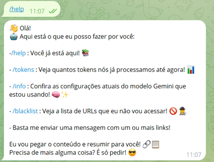
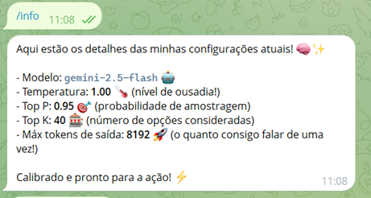
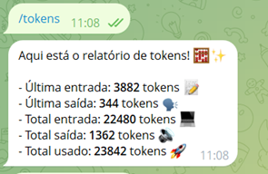
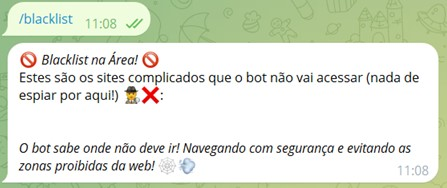

<h1 id="documentation">  📚  Documentação</h1>
<h3 id="gemini">   GEMINI</h3>

    O bot é altamente personalizável 🤖, permitindo que você ajuste o prompt de acordo com suas necessidades, resultando em respostas mais personalizadas ✍️. Você também pode configurar vários ajustes finos ⚙️, como o modelo e a temperatura, dependendo do contexto ou do tipo de saída que deseja gerar <a href="../src/gemini/api_client.py#83">aqui</a>.

    Por padrão, os seguintes parâmetros estão definidos:

<ul>
    <li><strong>Modelo:</strong> gemini-1.5-flash (Configurável via variável de ambiente) 🧠</li>
    <li><strong>Temperatura:</strong> 1 🌡️</li>
    <li><strong>Top P:</strong> 0.95 🎯</li>
    <li><strong>Top K:</strong> 40 📊</li>
    <li><strong>Máx. Tokens de Saída:</strong> 8192 📄</li>
    <li><strong>Tipo MIME da Resposta:</strong> application/json 📙</li>
</ul>

    Você pode modificar esses parâmetros para atender às suas necessidades específicas, como aumentar a temperatura para respostas mais criativas 🎨 ou diminuí-la para resultados mais determinísticos ✅. Da mesma forma, Top P, Top K e Top N podem ser ajustados para controlar o quão ampla ou restrita deve ser a seleção dos próximos tokens durante a geração.

> [!WARNING]
> Alterar o tipo MIME da resposta pode mudar a forma como o Gemini formata sua resposta e afetar o analisador (parser) do bot.

<h3 id="crawler"> 🕷️🤖  CRAWLER (Rastreador)</h3>

> [!NOTE]  
> Atualmente, não é possível definir parâmetros personalizados para o crawler 🚧.

    O crawler opera com uma configuração fixa projetada para recuperar e processar dados de forma eficiente 📂, mas atualizações futuras podem incluir opções para um controle mais granular ⚙️, como definir intervalos ⏲️ ou regras de extração de dados 📋.

<h3 id="usergroups"> 🧑‍🧑‍🧒‍🧒  USUÁRIOS E GRUPOS</h3>

    Em termos de interação com o usuário, o bot pode ser configurado para interagir tanto com usuários individuais 👤 quanto com usuários dentro de grupos 👥. Isso permite um engajamento flexível dependendo de suas necessidades.

    Por exemplo, se você definir <code>ADMIN_USER_ID=123</code> onde <code>123</code> é o ID do usuário, o bot poderá interagir com este usuário específico através de um chat privado 💬. Se desejar permitir que vários usuários interajam com o bot em chats privados separados, basta adicionar seus IDs assim: <code>ADMIN_USER_ID=123;456</code>. Dessa forma, cada usuário terá a capacidade de se comunicar privadamente com o bot 👥💬.

    Apenas usuários administradores podem adicionar o bot GemDigest a grupos. Uma vez adicionado, o GemDigest interagirá com todos no grupo — não é necessário status de administrador para interações padrão! No entanto, apenas administradores podem emitir comandos diretos para controlar os recursos do bot.
    Se um não-administrador tentar:
    <ul>
    <li><b>Criar um chat privado com o bot</b> – O GemDigest simplesmente ignorará a mensagem 🤷</li>
    <li><b>Adicionar o bot a outro grupo</b> – ele sairá educadamente do chat 👋</li>
    </ul>
    Essa configuração garante que o GemDigest funcione sem problemas em grupos e mantenha o controle com os usuários administradores!

> [!NOTE]  
> Para descobrir o ID de um usuário, siga este guia 📝: [whoami_bot](https://github.com/Armaggheddon/whoami_bot)

    Com essa configuração flexível, você pode ajustar como o bot se comunica 📞, seja para interações individuais ou discussões em grupo 🗨️💡.

<h3 id="defaultcommands"> 📋 COMANDOS PADRÃO</h3>

    Você pode usar os seguintes comandos predefinidos para obter informações sobre as funcionalidades do bot:

<ul>
    <li><strong>/help:</strong> Retorna uma lista de comandos disponíveis 📜</li>
    <li><strong>/tokens:</strong> Retorna o número de tokens utilizados 🔢</li>
    <li><strong>/info:</strong> Retorna informações como a temperatura atual e o modelo sendo usado 📊</li>
    <li><strong>/blacklist:</strong> Retorna a lista de sites para os quais o resumo não é necessário (ex: youtube) ⛔</li>
</ul>

    Exemplos dos comandos são fornecidos na tabela abaixo:

<table>
<tr>
    <th>Comando</th>
    <th>Descrição</th>
    <th>Imagem</th>
</tr>
<tr>
    <td><code>/help</code></td>
    <td>Exibe uma lista de todos os comandos disponíveis, ajudando você a explorar os recursos do bot mais facilmente 🛠️</td>
    <td></td>
</tr>
<tr>
    <td><code>/tokens</code></td>
    <td>Mostra o número de tokens usados até agora, ajudando a acompanhar o consumo de forma eficiente 🔍</td>
    <td></td>
</tr>
<tr>
    <td><code>/info</code></td>
    <td>Fornece detalhes sobre a configuração atual do bot, incluindo temperatura, modelo e outras configurações ⚙️</td>
    <td></td>
</tr>
<tr>
    <td><code>/blacklist</code></td>
    <td>Fornece a lista de sites que serão ignorados, como o YouTube ⛔</td>
    <td></td>
</tr>
</table>

<h3 id="blacklist"> ⛔  BLACKLIST (Lista de Bloqueio)</h3>

    Para adicionar um site à blacklist, você pode editar o arquivo <a href="../extra_configs/website_blacklist.txt"><code>website_blacklist.txt</code></a> e adicionar o site que deseja bloquear. Por exemplo, www.youtube.com e www.x.com já estão incluídos! Depois, feche o arquivo e reinicie o bot ou o container.

